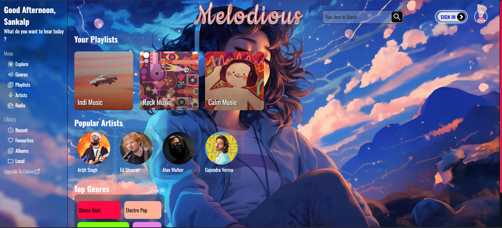
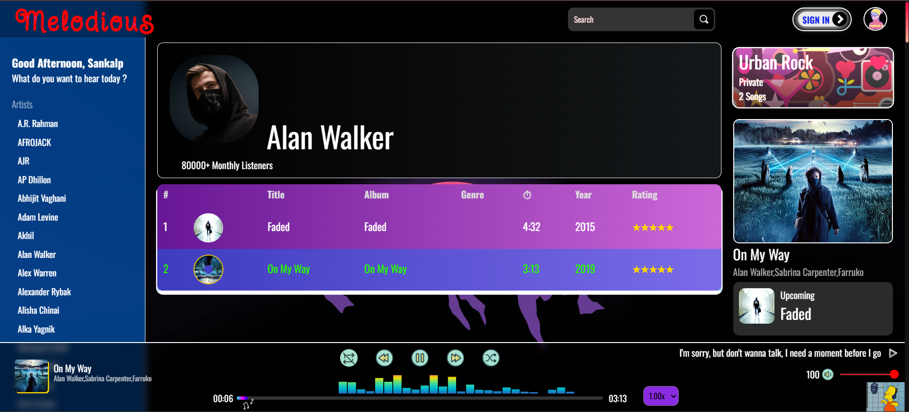

<!-- HEADER BANNER -->
<p align="center">
  
</p>

<p align="center">
  <b>A feature-packed, dynamic music player web app with intelligent playlist management, dynamic page creation, hidden Easter eggs, and a smooth, modern interface.<br>
  Built for music lovers, perfected for coders.</b>
</p>

---

## ✨ Features

- 🎧 **Full-Featured Music Player** — Play, pause, skip, shuffle, repeat, and control volume with ease.  
- 📜 **Dynamic Page Creation** — Artist pages, playlists, and song tables are generated automatically from metadata.  
- 🌟 **Recommendation System (Prototype)** — Suggests tracks based on play duration & listening patterns.  
- 🐣 **Easter Eggs** — Fun, hidden surprises for those who explore deeply.  
- 📂 **Automatic Song Library Builder** — Generate your `songs.js` file from your music folder in seconds.  
- 📱 **Responsive Design** — Looks great on desktop, tablet, and mobile.  
- ⚡ **Fast Loading** — Preloaded metadata for instant song switching.  
- 🔍 **Search & Filter** — Quickly find your favorite song or artist.  
- 😉 **Fuzzy Search** — Don’t remember the exact name? Just search around it.  
- 🎨 **Sleek UI** — Smooth animations, dark mode, and a visually pleasing layout.  
- 🎙️ **Voice Commands** — Control your music with just your voice.  

---

## 📸 Screenshots
| Playlist View | Artist Page | Main Screen |
|---------------|-------------|-------------|
|  |  |  |
|  |  |  |

---

## 🛠 Tech Stack

<p align="center">
  
  
  
  
  
</p>

---

## 📔 Libraries Used
- [Fuse.js](https://fusejs.io/) — Fuzzy search  
- [Color Thief](https://lokeshdhakar.com/projects/color-thief/) — Dynamic color extraction  
- [Oneko.js](https://github.com/adryd325/oneko.js) — Fun animated cat overlay  
- [Mutagen](https://mutagen.readthedocs.io/) — Python metadata parser  

---

## 📜 Code Features
- Clean and modular structure  
- Easy to maintain and scale  
- Separation of concerns for fast feature addition  

---

## 🐣 Easter Eggs
- **Konami Code** → Unlocks a retro visualizer  
- **Secret Drum Mode** → A Drum Pad is activated when a certain action  is done. You gotta find it.

---

## 🚀 Getting Started

### 1️⃣ Clone the repository
```bash
git clone https://github.com/sankalp6115/melodious.git
cd melodious
2️⃣ Install dependencies
npm install
3️⃣ Add your music
Download some songs (MP3 recommended).

Place them inside the music/ folder.

4️⃣ Generate the songs.js file
python JSON_maker.py
This will create a songs.js file.

5️⃣ Add songs.js to global scripts
Place it in the global scripts folder so the app can load your library.

6️⃣ Start the server
node server.js
Then open http://localhost:3000 in your browser.
```

## 🔄 How It Works
- Music Folder → JSON_maker.py → songs.js → App loads library dynamically
- Every artist/playlist page is created automatically from metadata.

- Dynamic UI updates without page refresh.

## 📅 Future Enhancements
- AI-powered playlist generation

- Online music streaming integration

- Social playlist sharing
- More Easter eggs 😉

👨‍💻 Author:
Sankalp Omar
- 💼 Portfolio
- 🐙 [Github](https://github.com/sankalp6115)
- ✉️ sankalpomar6115@gmail.com

📜 License
Licensed under the MIT License — feel free to use and modify.

⭐ If you like this project, please consider starring the repo on GitHub!

---